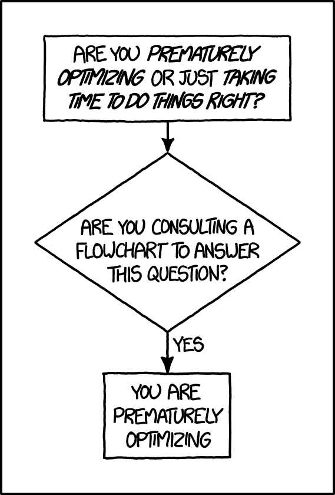

```{r setup, include=FALSE}
knitr::opts_chunk$set(echo = FALSE)
library(microbenchmark)
library(ggplot2)
library(dplyr)
```


## Performant R

# Don't Do It

## Premature optimization

"Premature optimization is the root of all evil" is one of the most 
[famous quotes](https://en.wikiquote.org/wiki/Donald_Knuth) in computer science.

>_Premature optimization_ is a phrase used to describe a situation where a programmer lets performance considerations affect the design of a piece of code. This can result in a design that is not as clean as it could have been or code that is incorrect, because the **code is complicated** by the optimization and the **programmer is distracted** by optimizing.

[Wikipedia](https://en.wikipedia.org/wiki/Program_optimization#When_to_optimize)

## Premature optimization

```{r, out.width = "300px"}

```

https://xkcd.com/1691/

# Know The Language

## Use R's vectorisation when possible

Loops in R are not necessarily slow...but whenever possible,
make use R's built-in _vectorisation_ (ability to operate concurrently on all elements of a vector).

## Use R's vectorisation when possible

Loops in R are not necessarily slow...but whenever possible,
make use R's built-in _vectorisation_ (ability to operate concurrently on all elements of a vector).

```{r eval=FALSE, echo=TRUE}
# Naive, non-vectorised approach
lsum <- 0
for(i in 1:length(x)) {
    lsum <- lsum + log(x[i])
}

# The clearer, faster R approach
lsum <- sum(log(x))
```

"This is speaking R with a C accent—a strong accent" [R Inferno](https://www.burns-stat.com/pages/Tutor/R_inferno.pdf)

## Use R's vectorisation when possible

Timing difference:

```{r, warning=FALSE}
loop <- function(x) {
    lsum <- 0
    for(i in 1:length(x)) {
        lsum <- lsum + log(x[i])
    }
    lsum
}

# The clearer, faster R approach
vectorised <- function(x) sum(log(x))

x <- microbenchmark(loop(1:100), vectorised(1:100))
print(x, signif = 3)
```

## Use dedicated functions and packages

Specialized functions such as `colSums`, `rowSums`, `colMeans`, and `rowMeans` 
are _fast_.

```{r, echo=TRUE}
x <- cbind(x1 = rnorm(1e4), x2 = rnorm(1e4))

mbm <- microbenchmark(rowSums(x), 
                      x[,1] + x[,2],
                      apply(x, 1, sum))
print(mbm, signif = 3)
```

## Use the best tool

Years ago a colleague and I wrote the [RCMIP5 package](https://cran.r-project.org/web/packages/RCMIP5/index.html) for
handling and summarizing [CMIP5](https://pcmdi.llnl.gov/mips/cmip5/) data in R.

**It was super slow.**

Then we discovered fast, specialized tools such as [CDO](https://code.mpimet.mpg.de/projects/cdo), [Panoply](https://www.giss.nasa.gov/tools/panoply/), and 
[NetCDF](https://docs.unidata.ucar.edu/netcdf-c/current/netcdf_working_with_netcdf_files.html).

Don't reinvent the wheel; use the best (hopefully, 
freely available and open source) tool for ths job.

# Do Less

## Don't carry unnecessary data

Subset/filter data _before_ computing on it; otherwise, you're doing 
unnecessary work.

Here we compute the mean price by color for "Ideal" diamonds:

```{r carry-data, echo=TRUE}
library(ggplot2) # for 'diamonds'
library(dplyr)
postfilter <- function() {
    diamonds %>% 
        group_by(cut, color) %>% 
        summarise(mean(price), .groups = "drop") %>%
        filter(cut == "Ideal")
}
```

## Don't carry unnecessary data

Subset/filter data _before_ computing on it; otherwise, you're doing 
unnecessary work.

Same operation, but first we isolate just the data we're interested in:

```{r pre-filter, echo=TRUE}
prefilter <- function() {
    diamonds %>% 
        filter(cut == "Ideal") %>% 
        group_by(color) %>% 
        summarise(mean(price))
}
```

## Don't carry unnecessary data

Subset/filter data _before_ computing on it; otherwise, you're doing 
unnecessary work.

Timing difference:

```{r, warning=FALSE}
x <- microbenchmark(postfilter(), prefilter())
print(x, signif = 3)
```

(This difference will get worse with larger data frames!)

## Don't do unnecessary things

Move any unnecesssary computations _outside_ of loops or repeatedly-called
functions.

For example, here we repeatedly calculate `avg` inside the loop:

```{r cruft-in-loop, echo=TRUE}
very_slow_average <- function(x) {
    sm <- 0
    for(i in seq_along(x)) {
        sm <- sm + x[i]
        avg <- sm / i
    }
    avg
}
```

## Don't do unnecessary things

Move any unnecesssary computations _outside_ of loops or repeatedly-called
functions.

Here we calculate `avg` only once, after the loop is finished:

```{r less-cruft-in-loop, echo=TRUE}
slow_average <- function(x) {
    sm <- 0
    for(i in x) {
        sm <- sm + i
    }
    sm / length(x)
}
```

## Don't do unnecessary things

Move any unnecesssary computations _outside_ of loops or repeatedly-called
functions.

Timing difference:

```{r, warning=FALSE}
x <- microbenchmark(very_slow_average(1:100), slow_average(1:100), mean(1:100))
print(x, signif = 3)
```

Wait, **why isn't there a bigger difference** between `slow_average` and R's
built-in `mean` function?!? 

## R's JIT compiler

Most of ther `slow_average()` calls weren't so slow because of R's
Just In Time (JIT) compiler.

An (old) example from [Dirk Eddelbuettel](http://dirk.eddelbuettel.com/blog/2011/04/12/):

```{r, echo=TRUE}
h <- function(n, x=1) for (i in 1:n) x=(1+x)^(-1)
print(h)
```

Printing `h` shows it to be a function, just as we expect.

## R's JIT compiler

```{r, echo=TRUE}
h(1e6) # run h() with a large n
print(h)
```

That's changed! Behind the scenes R has replaced our function with a _compiled_
version of it. **This compiled version is usually much faster.**

R is very smart about when to compile functions (technically, [closures](https://en.wikipedia.org/wiki/Closure_%28computer_programming%29)),
and you don't usually have to think about it. 
But it can mean that time-intensive functions run faster upon re-use.

# Do Smarter

## Understand memory allocation

When we `rbind` (and similar operations), R computes how much memory is needed
for the new object on [the heap](https://kagi.com/search?q=computer%20science%20heap), allocates that, copies everything to the new
location, and frees the old objects. **This is expensive.**

Creating a data frame with 100 copies of `cars`, calling `rbind` each time:

```{r rbind-in-loop, echo=TRUE}
rbind_in_loop <- function() {
    out <- data.frame()
    for(i in 1:100) out <- rbind(out, iris)
    out
}
```

## Understand memory allocation

When we `rbind` (and similar operations), R computes how much memory is needed
for the new object on [the heap](https://kagi.com/search?q=computer%20science%20heap), allocates that, copies everything to the new
location, and frees the old objects. **This is expensive.**

Creating a list of the 100 data frames and then calling `rbind` once:

```{r use-a-list, echo=TRUE}
use_a_list <- function() {
    out <- list()
    for(i in 1:100) out[[i]] <- iris
    do.call("rbind", out) # or dplyr::bind_rows()
}
```

## Understand memory allocation

When we `rbind` (and similar operations), R computes how much memory is needed
for the new object on [the heap](https://kagi.com/search?q=computer%20science%20heap), allocates that, copies everything to the new
location, and frees the old objects. **This is expensive.**

Timing difference:

```{r, warning=FALSE}
x <- microbenchmark(rbind_in_loop(), use_a_list())
print(x, signif = 3)
```

(This difference will get _much_ worse with larger data frames!)

## Think about your algorithms

A clueless prime number algorithm:

```{r, echo=TRUE}
slow_prime <- function(n) {
    if(n == 2) return(TRUE)
    for(i in 2:(n-1)) {
        if(n %% i == 0) return(FALSE)
    }
    return(TRUE)
}

slow_prime(7417)
slow_prime(7418)
```

## Think about your algorithms

A slightly less naive prime number algorithm:

```{r, echo=TRUE}
less_slow_prime <- function(n) {
    if(n == 2) return(TRUE)
    for(i in 2:sqrt(n)) {              # <----
        if(n %% i == 0) return(FALSE)
    }
    return(TRUE)
}

less_slow_prime(7417)
less_slow_prime(7418)
```

## Think about your algorithms

Timing difference:

```{r, warning=FALSE}
n <- 7417
x <- microbenchmark(slow_prime(n), less_slow_prime(n))
print(x, signif = 3)
```

## The R Profiler

R Profiler - TODO

# Do With More

## Parallelize on your machine

For tasks that are [embarrassingly parallel](https://en.wikipedia.org/wiki/Embarrassingly_parallel), and 
compute-bound, R's built-in `parallel` package can be a life-changer.

Use `mclapply()` to split a job across the different _cores_ of your
local machine:

```{r, echo=TRUE}
expensive_job <- function(x) Sys.sleep(2)

# Normal approach using lapply()
serial_approach <- function() lapply(1:4, expensive_job)

# Parallelized version using mclapply()
library(parallel)
parallel_approach <- function() mclapply(1:4, 
                                         expensive_job, 
                                         mc.cores = 4)
```

## Parallelize on your machine

For tasks that are [embarrassingly parallel](https://en.wikipedia.org/wiki/Embarrassingly_parallel),
R's built-in `parallel` package can be a life-changer.

Timing difference:

```{r, warning=FALSE}
x <- microbenchmark(serial_approach(), parallel_approach(), times = 1)
print(x, signif = 3)
```

## Parallelize on your machine

For tasks that are [embarrassingly parallel](https://en.wikipedia.org/wiki/Embarrassingly_parallel),
R's built-in `parallel` package can be a life-changer.

Note that **there is a small computational cost to sending jobs to new cores**,
so you may need to evaluate how 'big' (expensive) jobs are and how
they should be split up.

## Rcpp

Rcpp - TODO

## HPC

HPC - TODO

